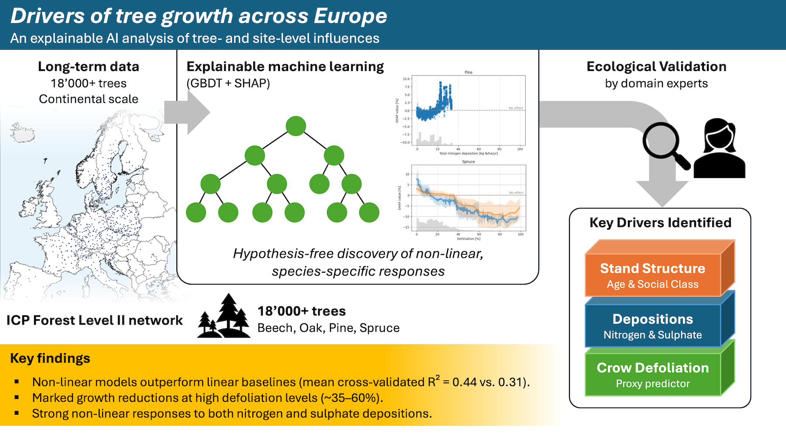

# Drivers of tree growth across Europe

This repository contains the code to reproduce the results of the study
"Drivers of tree growth across Europe: an explainable AI analysis of
tree- and site-level influences", submitted to *Ecological Informatics*.



## Abstract

Climate change is increasingly impairing forest ecosystems in Europe, reducing
tree vitality and increasing mortality. Crown defoliation and stem growth are
widely used indicators of early stress responses, yet their drivers remain
difficult to disentangle due to complex, non-linear interactions among
climatic, edaphic, and biotic factors.

Here, we apply explainable AI (XAI) to model annual diameter growth of
individual trees from four dominant European tree species (Norway spruce,
Scots pine, common beech, and oaks) using long-term data from the ICP Forests
 Level II network. Gradient-boosted decision trees trained on tree-level
 attributes (e.g., defoliation, social class) and plot-level variables (e.g.,
 soil solution chemistry, atmospheric deposition, and topography) outperform
 linear baselines (mean cross-validated R² = 0.44 vs. 0.31). Ablation
 experiments show that plot-level predictors explain most predictive power
 (77%) while defoliation contributes only marginally.

XAI analyses reveal strong non-linear, species-specific response regimes,
including marked growth reductions at high defoliation levels (~35–60%) and
optimal regimes of nitrogen and sulphate deposition, illustrating the capacity
of XAI to identify candidate growth-relevant regimes and interactions.

However, spatially explicit validation based on plot-wise cross-validation
leads to a near-complete collapse in predictive performance, indicating strong
reliance on spatial autocorrelation and context-specific patterns. Moreover,
ablating defoliation predictors causes attribution to shift toward correlated
environmental variables, highlighting the role of proxying and statistical
confounding.

Overall, our results illustrate both the potential and the limitations of XAI
for forest ecology: while effective for screening large observational datasets
and generating hypotheses, XAI outputs require cautious interpretation,
mechanistic understanding and spatially robust validation.

## Getting started

Install [`uv`](https://docs.astral.sh/uv/getting-started/installation/) and run
`uv sync` to install all dependencies.

If you want to modify the code, ensure to install
[`pre-commit` hooks](https://pre-commit.com/) prior to committing.

### Getting the data

Data can be requested to the Program Co-ordinating Center of IPC Forests:
<https://www.icp-forests.net/data-maps/data-requests>.

## Reproducing the results

- Copy the data in Parquet format in the `./data/raw` directory.
- Run the notebook `00-preprocessing.ipynb` to preprocess the raw data. This
  will generate the tidy data in the `./data/tidy` directory.
- You may then run the `01-explore.ipynb` notebook to explore the data.
- Finally, run the notebook `02-modeling.ipynb` to train the models and
  generate the figures of the paper. You must run manually the different
  variants and ablations by adjusting the following cell:

    ```python
    # Pick grouping strategy: "tree_id" or "plot_id"
    group_col = "tree_id"
    # Pick model type: "gbdt" or "lasso"
    model_type: ModelType = "gbdt"
    # Ablation: "all", "tree-level-only", "plot-level-only", "no-defoliation", "max-defoliation"
    ablation: Ablation = "all"
    ```

  Results are cached in the `./cache/` directory to avoid retraining models
  at each run.

## Support

For questions or issues, please open an issue on GitHub or contact the authors
directly.
